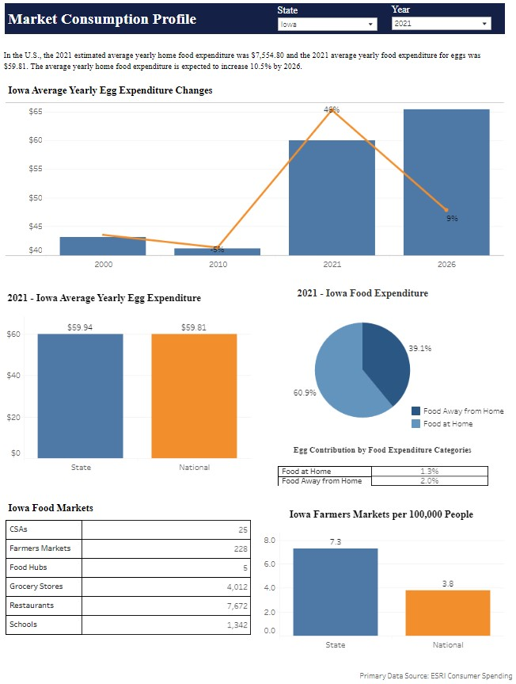
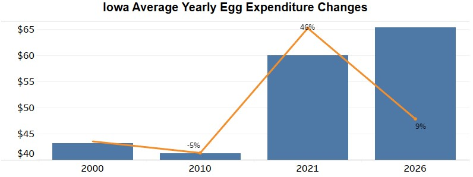
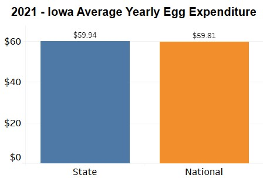
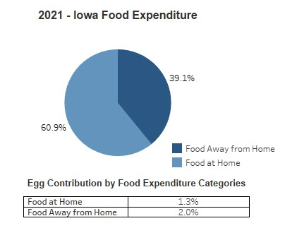
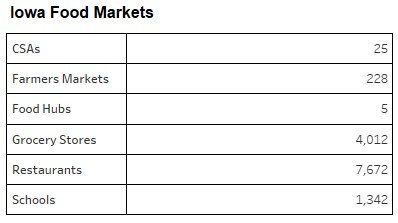
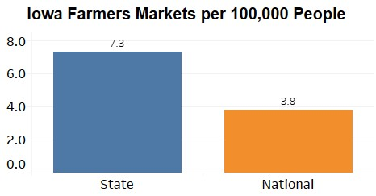

# Data Science for the Public Good

The Data Science for the Public Good (DSPG) Young Scholars program is an immersive summer program that engages students from across Iowa to work together on projects that address local and state government challenges around critical social issues relevant in the world today. Learn more about the program [here](https://dspg.iastate.edu/).

 

## AgMRC Commodity Reports
AGMRC Commodity Reports in tableau can be used as preliminary research in determining current production, market analysis, demographic data and price points. It can be useful in applying for a wide variety of grant funding, financial institutional loans, etc. The customizable marketing studies provide Value Added Producer Grant (VAPG) applicants with market intelligence that can easily be incorporated into feasibility studies and business plans that support the application process.

 

### **Objectives**

Develop end to end automated report:
- create two commodity reports(Egg and Beef)
- data discovery to find data sources to create finer detailed final product
- explore new and interesting infographic techniques applicable to increased understanding
- streamline all reports with better filters to handle differing data based on geography and year
- Use tools like R for data manipulation

 

### **Outcomes**

### Market Consumption Profile

#### Author: Joel Martin

 

This page is an overview of the market consumption profile and data behind it.

##### Report Page

 

### Data Sources

| Data Name                           | Level     | Accessed Through                    | Usage                                                                                 | Website                                                                                                                                                                                              |
|-------------------------------------|-----------|-------------------------------------|---------------------------------------------------------------------------------------|------------------------------------------------------------------------------------------------------------------------------------------------------------------------------------------------------|
| ESRI Consumer Spending              | Primary   | Arc GIS Pro and previous teams work | Used to find consumer spending for egg, beef, and overall food at and away from home. | [https://doc.arcgis.com/en/esri-demographics/latest/regional-data/consumer-spending.htm](https://doc.arcgis.com/en/esri-demographics/latest/regional-data/consumer-spending.htm)                     |
| USDA Agricultural Marketing Service | Secondary | MariaDB                             | Used to find number of CSAs and farmers markets in a state.                           | [https://www.ams.usda.gov/](https://www.ams.usda.gov/)                                                                                                                                               |
| CDC State Indicator Report          | Secondary | MariaDB                             | Used to find number of food hubs in a state.                                          | [https://www.cdc.gov/nutrition/data-statistics/2018-state-indicator-report-fruits-vegetables.html](https://www.cdc.gov/nutrition/data-statistics/2018-state-indicator-report-fruits-vegetables.html) |
| Data Axle Genie                     | Secondary | MariaDB                             | Used to find number of grocery stores and restaurants in a state.                     | [https://www.dataaxlegenie.com/](https://www.dataaxlegenie.com/)                                                                                                                                     |

 

### Data Acquisition

The primary ESRI data source had 2020 and 2010 data from the previous Data Science teams work.

Through Iowa State University, I was able to get a temporary license to get access to new 2021 and 2026 predictions.

The secondary data sources were re-used from the previous teams work.

 

### Data Transformation

After accessing the new ESRI data through Arc GIS Pro, the following R script was used to: 

1. Combine the old ESRI data to the new ESRI data
2. Transform the data from wide format into long format
3. General cleaning of column names and standardization of state names

 

### ESRI Transformation Code

If you would like to see the R code used to transform the ESRI data please click [here](https://github.com/DSPG-2022/AgMRC-Commodities/blob/main/Joel_Martin/esri_data_cleaning_and_transformation_to_wide_and_long.R).
